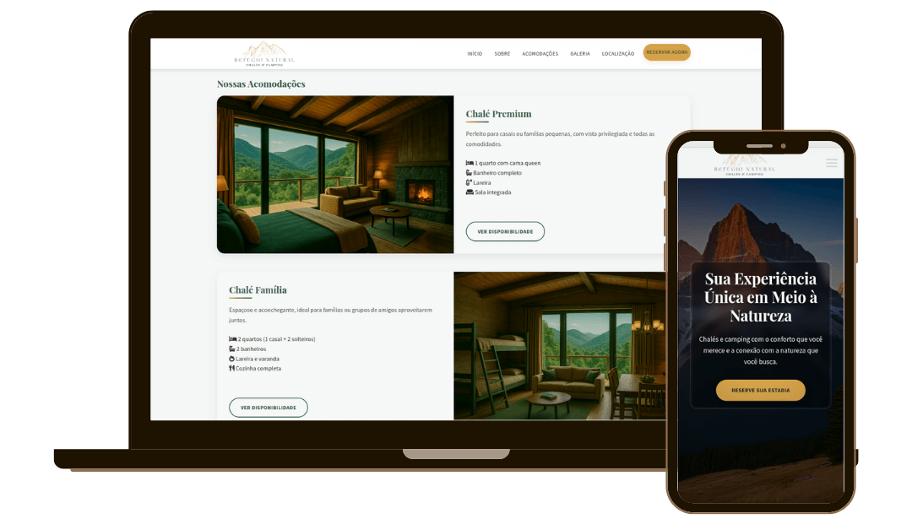

# Refúgio Natural - Camping & Chalés

## Sobre o Projeto

Site institucional para o empreendimento Refúgio Natural, focado em hospedagem em chalés e camping na Serra Catarinense. Desenvolvido com design responsivo e moderna experiência de usuário para promover os serviços e facilitar reservas.

**Demo:** [https://gabrielabade.github.io/camping/](https://gabrielabade.github.io/camping/)

## Características Principais

- **Design Responsivo**: Adaptação perfeita para qualquer dispositivo
- **Experiência Imersiva**: Layout clean com elementos visuais de natureza
- **Performance Otimizada**: Carregamento rápido e experiência fluida
- **Formulário de Reserva**: Sistema integrado com WhatsApp
- **Galeria Interativa**: Lightbox para visualização ampliada
- **Depoimentos**: Carrossel de feedback de clientes

## Tecnologias Utilizadas

- HTML5
- CSS3 
- JavaScript 
- Font Awesome
- Google Fonts 

